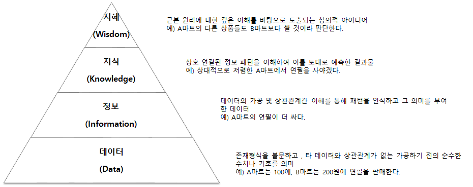

# 데이터와 정보

## 데이터의 정의와 특성
### 데이터의 정의

### 데이터의 특성
- 존재적 특성: 객관적 사실
- 당위적 특성: 추론, 예측, 전망, 추정을 위한 근거

## 데이터의 유형
| 구분 | 형태 | 예 | 특징 |
|------|-------|-------|-------|
|정성적 데이터| 언어, 문자 등|회사 매출이 증가함|저장 검색 분석에 많은 비용이 소모됨|
|정량적 데이터|수치, 도형, 기호 등|나이, 몸무게, 주가|비용 소모가 적음|
## 지식경영의 핵심 이슈
| 구분 | 의미 | 예 | 특징 | 상호작용 |
|------|-------|-------|-------|-------|
|암묵지|학습과 경험을 통해 개인에게 체화되어 있지만  겉으로 드러나지 않는 지식|김장김치 담그기, 자전거 타기|사회적으로 중요하지만 다른사람에게 공유되기 어려움|공통화, 내면화|
|형식지|문서나 매뉴얼처럼 형상화된 지식|교과서, 비디오, DB|전달과 공유가 용이함|표출화, 연결화|
> 내면화 -> 공통화 -> 표출화 -> 연결화 -> 내면화
## 데이터와 정보의 관계
### DIKW의 정의
- Data: 단순한 사실
- Information: 데이터를 가공하여 의미를 부여한 결과
- Knowledge: 정보를 통해 얻은 지식
- Wisdom: 지식을 통해 행동을 취하는 능력

### DIKW 피라미드

# 데이터베이스 정의와 특징

## 용어의 연혁
## 데이터베이스의 정의

## 데이터베이스의 특징
### 데이터베이스의 일반적인 특징
- 통합된 데이터: 동일한 내용의 데이터가 `중복되어 있지 않다.` 데이터 중복은 관리상의 복잡한 부작용을 초래.
- 저장된 데이터: 자기 디스크나 자기 테이프 등과 같이 `컴퓨터가 접근할 수 있는 저장 매체에 저장되는 것`을 의미. 데이터베이스는 기본적으로 컴퓨터 기술을 바탕으로 한 것
- 공용 데이터: `여러 사용자`가 `서로 다른 목적`으로 `데이터를 공동으로 이용`한다는 것을 의미. 대용량화되고 구조가 복잡한 것이 보통
- 변화하는 데이터: 데이터베이스에 `저장된 내용`은 곧 데이터베이스의 `현 시점에서의 상태`를 나타냄.

### 데이터베이스의 다양한 측명에서의 특징

# 데이터베이스의 활용
## 기업내부 데이터베이스
### 1980년대 기업내부 데이터베이스
- OLTP(On-Line Transaction Processing): 실시간 처리
- OLAP(On-Line Analytical Processing): 분석 처리
### 2000년대 기업내부 데이터베이스
- CRM(Customer Relationship Management): 고객 관리
- SCM(Supply Chain Management): 공급망 관리
### 각 분야별 내부 데이터베이스
- 제조부문
	- ERP(Enterprise Resource Planning)에서 CRM으로 발전
	- RTE(Real-Time Enterprise)를 통한 협업적 IT화의 비중 확대
- 금융부문
	- EAI(Enterprise Application Integration), ERP, e-CRM을 통한 시스템 통합
	- DW(Data Warehouse)와 BI(Business Intelligence)를 통한 데이터 분석
- 유통부문
	- CRM, SCM 구축
	- 상거래를 위한 인프라와 KMS(Knowledge Management System)을 위한 백업시스템 구축
	- RFID
### 사회기반구조로서의 데이터베이스
- 물류부문
	- CVO(Commercial Vehicle Operation)를 통한 물류정보의 실시간 공유
	- PORT-MIS(Port Management Information System)을 통한 항만정보의 실시간 공유
	- KROIS(Korea Railway Operation Information System)을 통한 철도정보의 실시간 공유
- 지리/교통부문
	- GIS(Geographic Information System)을 통한 지리정보의 실시간 공유
	- ITS(Intelligent Transportation System)을 통한 교통정보의 실시간 공유
	- GPS
	- RS(Remote Sensing)
	- LBS(Location Based Service)
	- SIM(Spatial Information Management)
- 의료부문
	- PACS(Picture Archiving and Communication System)을 통한 의료정보의 실시간 공유
	- U헬스
- 교육부문
	- NEIS(National Education Information System)을 통한 교육정보의 실시간 공유