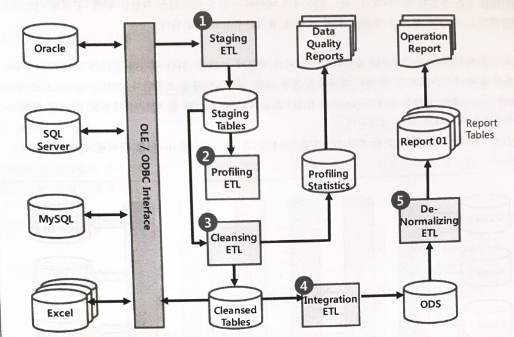
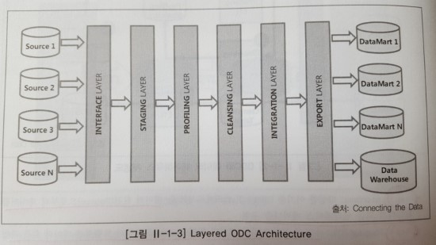

# ETL
## ETL 개요
### ETL 개념 및 특징
### ETL의 기능
### ETL의 작업 단계

1. 수립된 일정에 따라 데이터 원천으로부터 트랜잭션 데이터 휙득 작업 수행 후, 휙득된 데이터를 스테이징 테이블에 저장
2. 스테이징 테이블에서 데이터 특성을 식별하고 품질 측정
3. 다양한 규칙들을 활용해 프로파일링된 데이터의 보정작업을 수행
4. 데이터 충돌을 해소하고, 클렌징된 데이터 통합
5. 운영 보고서 생성 및 데이터 웨어하우스 또는 데이터 마트에 대한 데이터 적재를 위해 데이터 비정규화 수행

## ODS(Operational Data Store) 구성
### ODS의 개념 및 특징
- 일반적으로 실시간, 혹은 실시간 근접 트렌랜잭션 데이터, 가격 등의 원자성을 지닌 하위 수준 데이터들을 저장하기 위해 설계됨.

### ODS 구성 단계

1. interface 단계
    - 다양한 데이터 원천으로부터 데이터를 휙득
    - OLEDB, ODBC, FTP 등이 사용됨.
2. staging 단계
    - 휙득된 데이터를 스테이징 테이블에 저장
    - 데이터의 특성을 식별하고 품질 측정
    - 실시간 혹은 batch 작업을 혼용할 수 있다.
3. profiling 단계
    - 범위, 도메인, 유일성 확보 등의 규칙을 기준으로 데이터의 품질 측정
    - 데이터 프로파일링 수행 -> 데이터 프로파일링 결과 통계 처리 -> 데이터 품질 보고서 생성 및 공유의 절차를 거친다.
4. cleansing 단계
    - 다양한 규칙을 활용해 프로파일링된 데이터의 보정작업을 수행
5. integration 단계
    - 데이터 충돌을 해소하고, 클렌징된 데이터 통합
6. export 단계
    - 운영 보고서 생성 및 데이터 웨어하우스 또는 데이터 마트에 대한 데이터 적재를 위해 데이터 비정규화 수행

## 데이터 웨어하우스
### 데이터 웨어하우스란?
### 데이터 웨어하우스의 특징
1. 주제 중심성: 데이터 웨어하우스의 데이터는 실 업무 상황의 특정 이벤트나 업무 항목을 기준으로 구조화되므로, 최종 사용자도 이해하기 쉬운 형태를 지님.
2. 영속성 / 비휘발성: 데이터 웨어하우스의 데이터는 최초 저장 이후에는 읽기 전용의 속성을 가지며, 삭제되지 않음.
3. 통합성: 데이터 웨어하우스의 데이터는 기관 조직이 보유한 대부분의 운영 시스템들에 의해 생성된 데이터들의 통합본
4. 시계열성: 운영 시스템들은 최신 데이터를 보유하고 있지만, 데이터 웨어하우스는 시간 순에 의한 이력 데이터를 보유
### 데이터 웨어하우스의 테이블 모델링 기법
- 스타 스키마: 데이터 웨어하우스의 테이블 모델링 기법 중 하나로, 중심 테이블을 중심으로 여러 차원 테이블들이 연결된 형태
- 스노우플레이크 스키마: 스타 스키마의 확장형으로, 차원 테이블들이 정규화된 형태로 구성된다
### ODS와 DW의 비교

# CDC(change data capture)

# EAI(Enterprise Application Integration)

# 데이터 통합 및 연계 기법

# 대용량의 비정형 데이터 처리방법
## 대용량 로그 데이터 수집
- 수집 시스템 예: 아파치 Flume-NG, 페이스북 Scribe, 아파치 Chunkwa (예시가 왜 이따윈데)
## 대규모 분산 병렬 처리
### 하둡
- 맵리듀스 시스템과 분산 파일시스템인 HDFS를 핵심 구성요소로 가지는 플랫폼 기술
- 비공유 분산 아키텍처

### 하둡의 특징
1. 선형적인 성능과 용량 확장: 하둡은 수평적 확장이 가능하며, 클러스터에 노드를 추가함으로써 선형적인 성능 향상을 기대할 수 있다.
2. 고장 감내성: HDFS에 저장되는 데이터는 3중복제로 저장되므로, 노드의 고장에도 데이터의 손실이 없다제
3. 핵심 비즈니스 로직에 집중
4. 하둡 에코 시스템
    - 비정형 데이터 수집: 척와, 플럼, 스크라이브
    - 정형 데이터 수집: 스쿱, 히호
    - 분산 데이터 저장: HDFS
    - 분산 데이터베이스: HBase
    - 분산 데이터 처리: 맵리듀스
    - 리소스 관리: YARN
    - 인메모리 처리: 아파치 스파크
    - 데이터 가공: 피그, 하이브
    - 데이터 마이닝: 머하웃
    - 실시간 SQL 질의: 임팔라, 타조
    - 워크플로우 관리: 우지
    - 분산 코디네이션: 주키퍼
## 데이터 연동
### 데이터 연동의 개요
### 스쿱

## 대용량 질의 기술
### 대용량 질의 기술의 개요
### SQL on 하둡 기술

1. 3
2. 3 (2)
3. 3 (?) (2)
4. 3 (2)
5. 4
6. 3 (구글이 처음 고안한 기술?)
7. 2 (3은 뭐야)
8. 1
9. 1
10. 4
11. 4
12. 1
13. 3
14. 2
15. 3
16. 4
17. 3 (4)
18. 2
19. 1
20. 2

1. extract
2. 영속성 / 비 휘발성
3. EAI
4. 로그
5. 멥 리듀스
6. 스쿱
7. hive
8. 페이스북 스크라이브 (프레스토)
9. ODC
10. 스노우 플레이크 스키마