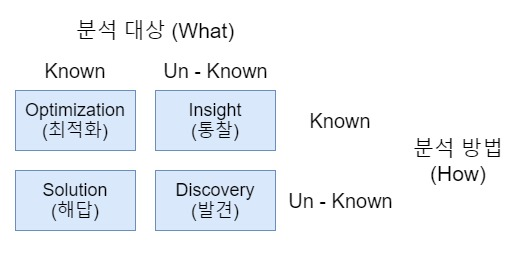
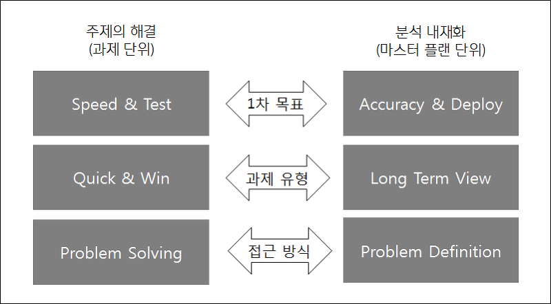

# 분석 기획 방향성 도출
## 분석기획의 특징
### 분석기획이란?
- 실제 분석을 수행하기에 앞서 분석을 수행할 `과제를 정의`, 의도했던 `결과를 도출`할 수 있도록 이를 적절하게 `관리`할 수 있는 방안을 `사전에 계획`하는 일련의 작업
- 분석과제 및 프로젝트를 직접 수행하는것은 아님.
- 어떠한 목표(what)을 달성하기 위하여 어떠한 데이터(why)를 가지고 어떤 방식(how)으로 수행할지에 대한 일련의 계획을 수립하는 작업.
### 데이터 사이언티스트의 역량

## 분석 대상과 방법

## 목표 시점 별 분석 기획 방안

## 분석 기획시 고려사항

# 분석 방법론
## 분석 방법론 개요
### 개요
- 데이터 분석이 효과적으로 기업 내에 정착하기 위해서는 체계화한 절차와 방법이 정리된 분석 방법론의 수립이 필수적이다.
- 방법론은 싱세한 절차, 방법, 도구와 기법, 템플릿과 산출물로 구성되어 어느정도의 지식만 있으면 활용이 가능해야 한다.
### 데이터 기반 의사결정의 필요성
### 방법론의 생성과정
### 방법론의 적용 업무의 특성에 따른 모델
1. 폭포수 모델
2. 프로토타입 모델
3. 나선형 모델
### 방법론의 구성

## KDD 분석 방법론
### 개요
### KDD 분석 절차
1. 데이터셋 선택: 비즈니스 도메인에 대한 이해와 프로젝트 목표 설정이 필수
2. 데이터 전처리: 잡음, 이상치, 결측치를 식별하고 제거하거나 의미있는 데이터로 재처리함. 추가로 요구되는 데이터가 있을 경우 1번으로 돌아감.
3. 데이터 변환: 목적에 맞게 변수를 생성, 선택하고 데이터의 차원을 축소하여 효율적으로 데이터 마이닝을 할 수 있도록 데이터에 변경하는 단계. 학습용 데이터와 시험용 데이터로 분리.
4. 데이터 마이닝: 데이터 마이닝 기법을 선택. 필요에 따라 2, 3번 단계로 돌아감
5. 해석 및 평가

## CRISP-DM 분석 방법론
### 개요
### CRISP-DM의 4레벨 구조
### CRISP-DM의 프로세스

## KDD와 CRISP-DM의 비교
## 빅데이터 분석 방법론
### 빅데이터 분석의 계층적 프로세스
### 빅데이터 분석 방법론 - 5단계
### 단계별 세부단계 및 실제 업무

# 분석 과제 발굴
## 분석과제 발굴 방법론
### 개요
### 하향식 접근법
### 상향식 접근법

# 분석 프로젝트 관리 방안
## 분석과제 관리를 위한 5가지 주요 영역
## 분석 프로젝트의 특성
### 개요
## 분석 프로젝트의 관리방안
