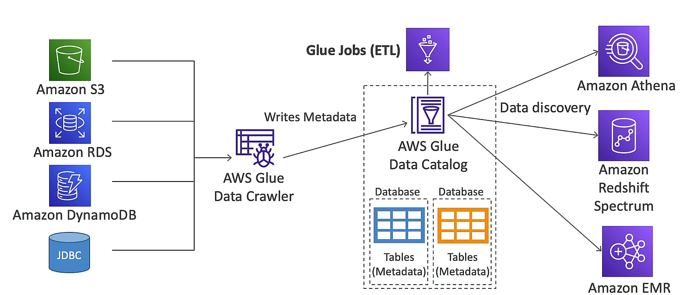

SQL` queries
- `S3` as data source
- supports `CSV`, `JSON`, `Parquet`, `ORC` data formats
- 5$ per TB scanned
## Performance Improvement
- use `columnar` data formats (less scan) => `Parquet`, `ORC` by using `AWS Glue`
- compress data => `GZIP`, `Snappy`, `LZO`
- `partition datasets` in S3 for easy querying on virtual columns (path)
- `Use larger files` (> 128MB) to minimize overhead

## Federated Query
allows you to query data in relational, non-relational, object, ... in a single query on AWS or on-premises

# Amazon Redshift
based on postgres, `not used for OLTP` but `OLAP`
copies data from `S3`, `DynamoDB`, `RDS`, `Kinesis`, `EMR`, `Data Pipeline`, `Glue`, `Redshift Spectrum`

## cluster
- leader node
- compute node

## snapshots and DR
- Multi-AZ for some cluster
- snapshots are point-in-time backups in S3
- change is saved
- automate snapshot, manual snapshote

## loading data into redshift
1. Amazon Kinesis Data Firehose
2. Amazon S3 copy
3. EC2 instance JDBC driver

## Redshift Spectrum
: `query data directly in S3` without loading it into Redshift

# Amazon openSearch Service
: `managed` `Elasticsearch` and `Kibana` service
# Amazon EMR
: `managed` `Hadoop` and `Spark` service
# AWS Glue
: `managed` serverless `ETL` service

# Kinesis
- `real-time` data streaming
- `Kinesis Data Streams`: `real-time` data streaming
- `Kinesis Data Firehose`: `load` data into `S3`, `Redshift`, `ElasticSearch`, `Splunk`
- `Kinesis Data Analytics`: `real-time` data analytics
- `Kinesis Video Streams`: `real-time` video streaming