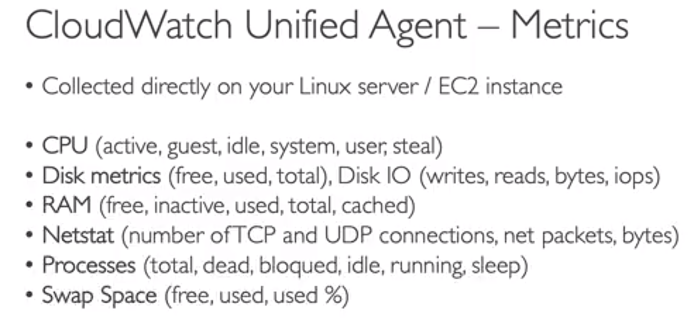

# Amazon CloudWatch
## Matrics
- every service sends metrics to CloudWatch
- `namespace` is a container for metrics
- `metric` is a variable to monitor
- `dimension` is a name/value pair that is attributed to a metric
- up to 30 dimensions per metric
- `timestamp` is the time of the data point
- stream data to destination `near real-time`

## logs
- log data is stored indefinitely
- `log group` is a container for logs
- `log stream` is a sequence of log events
- `log event` is a record of some activity
- SDK, Elastic Beanstalk, ECS, Lambda, CloudTrail, VPC Flow Logs, Route 53, API Gateway, CloudWatch Unified Agent can send logs to CloudWatch Logs
- log subscription: send logs to Lambda, Kinesis, ElasticSearch, S3

## cloudwatch agent
- collect more system-level metrics

## CloudWatch Alarms
- `alarm` is a notification that is sent when a metric is in `breach` of the threshold
- state: `OK`, `ALARM`, `INSUFFICIENT_DATA`
- target: stop, terminate, reboot, recover, start, or snapshot an instance / trigger an Auto Scaling action / send a notification to an SNS topic
- single metric alarm, composite alarm, anomaly detection alarm

## CloudWatch Events (EventBridge)
- cron jobs
- `event` is a change in state
- `rule` is a description of an event pattern
- `target` is a resource that is invoked when a rule is triggered
- `event bus` is a container for events
- `event pattern` is a JSON object that describes a set of events to match

# AWS CloudTrail
- `CloudTrail` is a service that enables governance, compliance, operational auditing, and risk auditing of your AWS account in all region or single region
- `trail` is a configuration that enables delivery of events as log files to an Amazon S3 bucket
- 90 days retention period
## Management Events
- `management events` provide information about management operations that are performed on resources in your AWS account
## Data Events
- `data events` provide information about the resource operations performed on or within a resource
- by default, data events are not logged

## Insights Events
- `insights events` provide insights into the performance and availability of your AWS Account

# AWS Config
- `config` is a service that enables you to assess, audit, and evaluate the configurations of your AWS resources