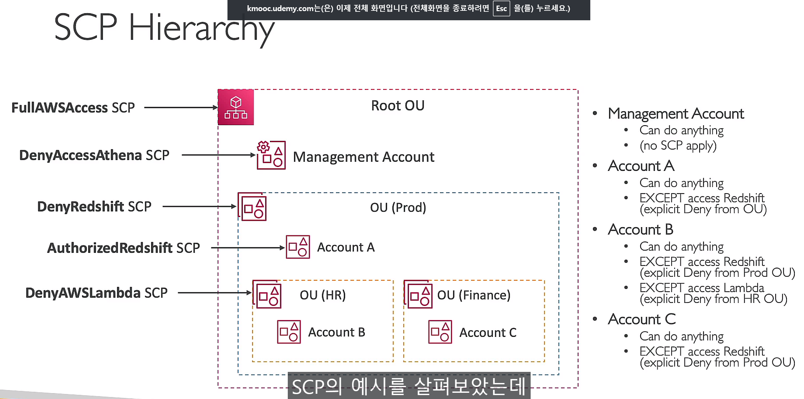
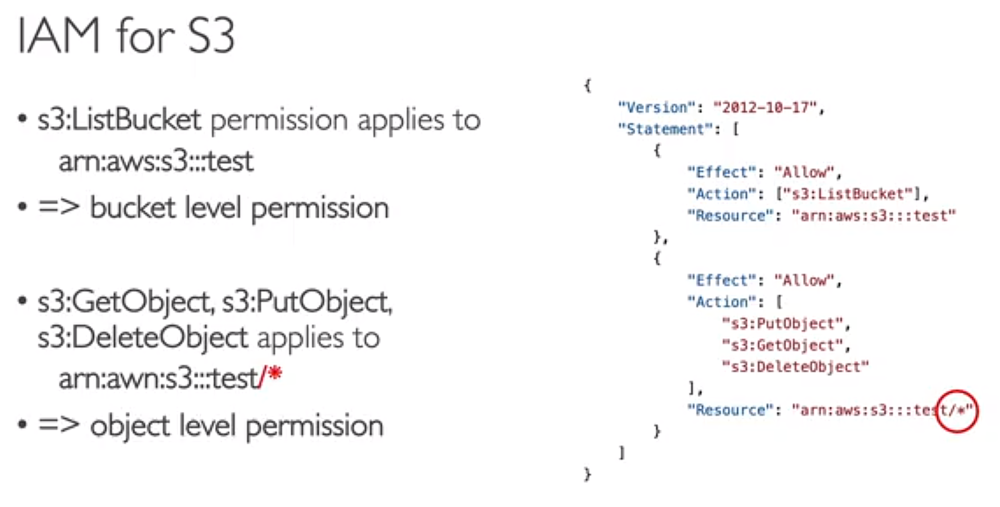
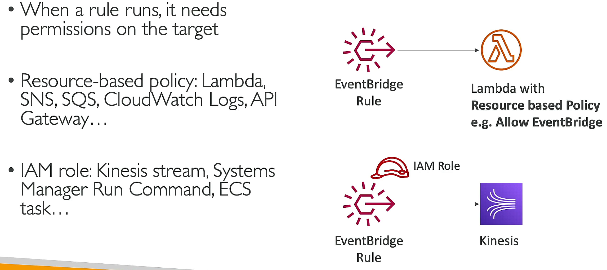
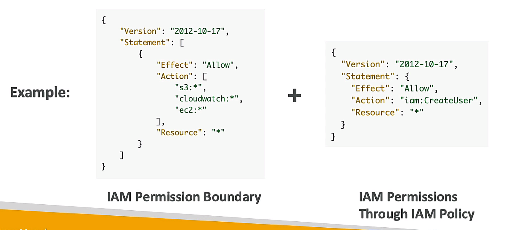

# AWS Organization
- global service
- `control` over multiple AWS accounts
- `consolidated billing`
- shared reserved instances and savings plans across accounts
## service control policies (SCPs)
- IAM policy applied to OU or account except management account

## IAM role vs Resource-based policy
- IAM role: `cross-account` access
- Resource-based policy: `cross-service` access

## IAM Permission boundaries
- supported for users and roles(not groups)
- maximum permissions that an entity can have
- `IAM policy` + `permission boundary` = `effective permissions`

## AWS IAM Identity center (AWS Single Sign-On)

## AWS Directory Service
- `AD Connector`: on-premises AD, redirect to on-premises AD (proxy)
- `Simple AD`: standalone AD
- `AWS Managed Microsoft AD`: managed AD, trust relationship
