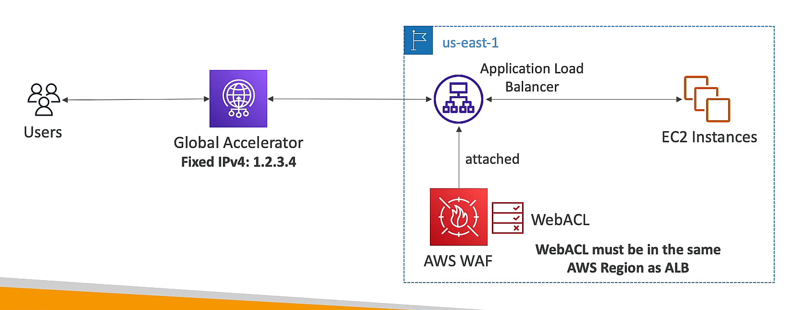

## KMS(Key Management Service)
- `managed` service to create and control encryption keys
- Able to audit key usage with `CloudTrail`
- attached to region => can replicate across regions

### types
- symmetric key: same key for encryption and decryption
- asymmetric key: public and private key

### KMS key type
- AWS owned key: managed by AWS
- AWS Managed key: managed by AWS but you have control over the key policy
- Customer managed key: managed by you, but AWS manages the underlying infrastructure, not free

### KMS key policy
- `key policy` is attached to the key
- Default key policy: complete access to the key
- custom key policy: define who can use the key and roles and who can administer the key

## AWS WAF(Web Application Firewall)
### deploy on
- CloudFront `(global)`
- Application Load Balancer (regional)
- API Gateway (regional)
- AppSync GraphQL API (regional)
- cognito (regional)

### features
- protect from SQL injection, cross-site scripting, and other web attacks
- IP blacklisting and whitelisting
- filter HTTP headers / body / URI
- limit the size of requests
- geo-blocking
- rate limiting (DDoS protection)

## AWS Shield
- `DDoS` protection service
- `Standard` and `Advanced` plan

## AWS Firewall Manager
- `central` management service to configure and manage WAF rules across accounts and applications

## Amazon GuardDuty
- `threat detection` service
- good for detect crypto currency mining

## Amazon Inspector
- `security assessment` service
- `continuous assessment` of applications for vulnerabilities and deviations from best practices

## Amazon Macie
- `data security` and `data privacy` service
- `detect` and `protect` sensitive data
