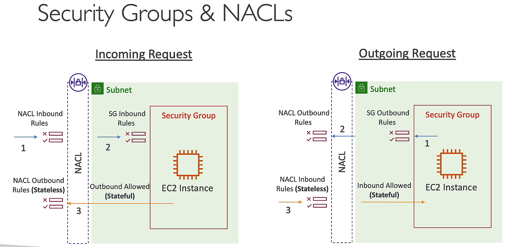
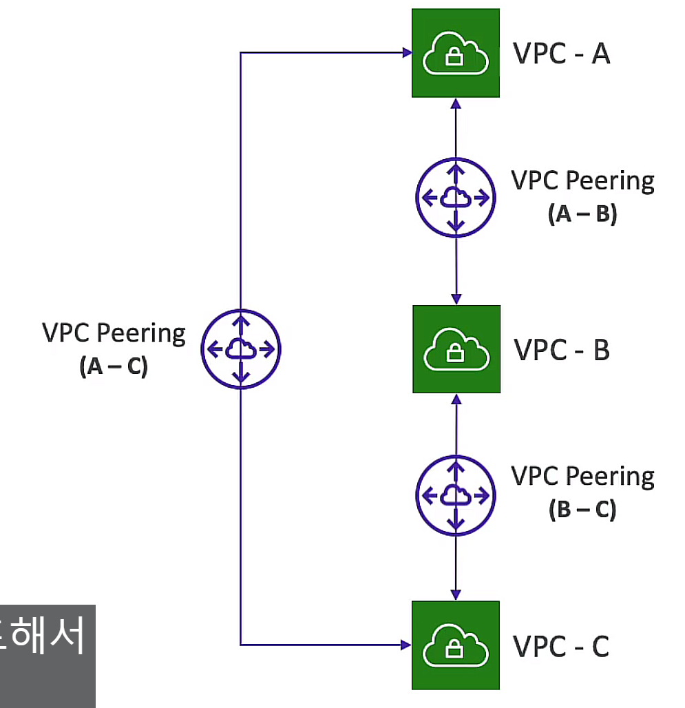
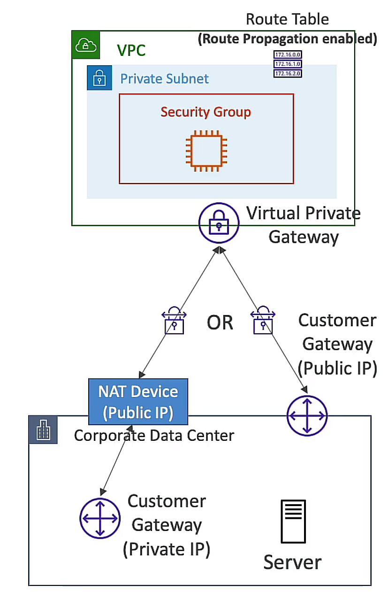

# VPC
## NAT GATEWAY
: AWS managed NAT instance, use specific AZ, elastic IP
only for another subnet

## NACLs
: stateless, allow/deny traffic in/out of subnet
default, `it allows all traffic`

## VPC peering

## VPC endpoint
: `private` connection between VPC and AWS services
- Gateway endpoint: S3, DynamoDB. taget of route table
- Interface endpoint: API Gateway, CloudWatch, KMS, SSM, S3, DynamoDB, etc.

## VPC flow logs
: VPC flow logs, capture information about IP traffic going to and from network interfaces in your VPC

## site-to-site VPN
: connect on-premises network to AWS VPC

## direct connect(DX)
: dedicated network connection between on-premises and AWS

## Egress-only Internet Gateway
: IPv6 only, allow outbound traffic to the internet
