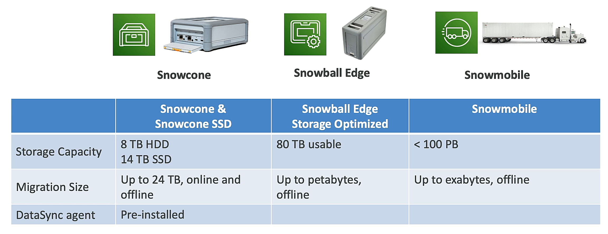
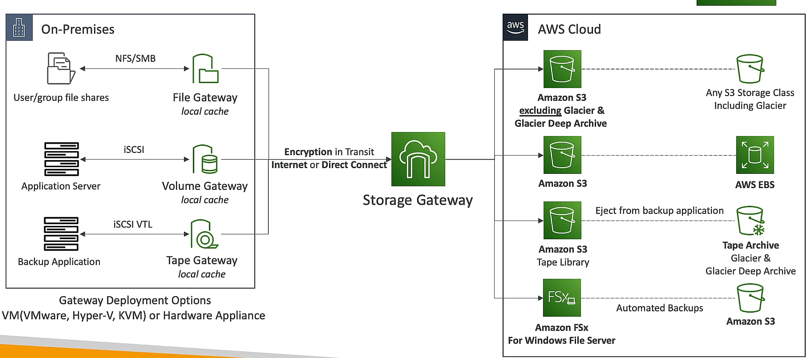

## AWS Snow Family
- AWS Snow Family is a collection of physical devices designed for use in edge locations, data centers, and in disconnected environments.
- Data Migration: snowcone, snowball edge, snowmobile
- Edge Computing: snowcone, snowball edge

### use process
1. Order: Order a Snow device from the AWS Management Console.
2. install: Install the Snow client / AWS ops hub on your server
3. Transfer: Transfer data to the Snow device using the Snow client.
4. Ship: Ship the Snow device back to AWS.
5. Load: Load the data into your S3 bucket.

## AWS FSx
- Amazon FSx for Windows File Server: fully managed Windows file system
- Amazon FSx for Lustre: fully managed Lustre file system, seamlessly integrated with S3 (can read and write data directly to S3)
- Amazon FSx for NetApp ONTAP: fully managed NetApp ONTAP file system, point-in-time snapshots, data deduplication, and data compression
- Amazon FSx for OpenZFS: fully managed OpenZFS file system, point-in-time snapshots, data deduplication, and data compression

### File System Deployment Options
- Scratch File System: temporary storage for data processing. no replication.
- Persistent File System: long-term storage for data processing. replicate data across multiple Availability Zones.

## AWS Storage Gateway
- AWS Storage Gateway is a hybrid cloud storage service that gives you on-premises access to virtually unlimited cloud storage.
- S3 File Gateway: store and retrieve objects in Amazon S3 using file protocols (NFS, SMB), cache data locally, not glacier.
- FSx File Gateway: store and retrieve objects in Amazon FSx using file protocols (NFS, SMB) for window file server.
- Volume Gateway: store and retrieve objects in Amazon S3, EBS Snapshot using iSCSI protocol.
	- cached volume: cache frequently accessed data locally.
	- stored volume: entire dataset stored locally, asynchronously backed up to S3.
- Tape Gateway: store and retrieve objects in Amazon S3 using virtual tape library (VTL) interface

## AWS DataSync
- AWS DataSync is a data transfer service that makes it easy for you to automate moving data between on-premises storage and Amazon S3, Amazon Elastic File System (Amazon EFS), or Amazon FSx for Windows File Server.
- File permissions and metadata are preserved during transfer.
- if not aws to aws, need agent to transfer data.