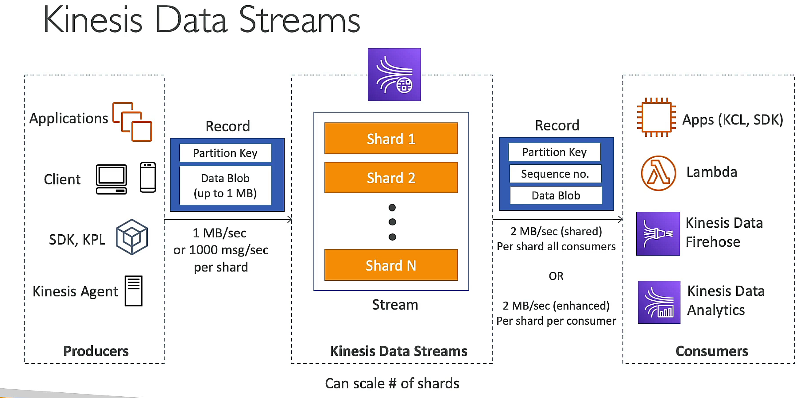
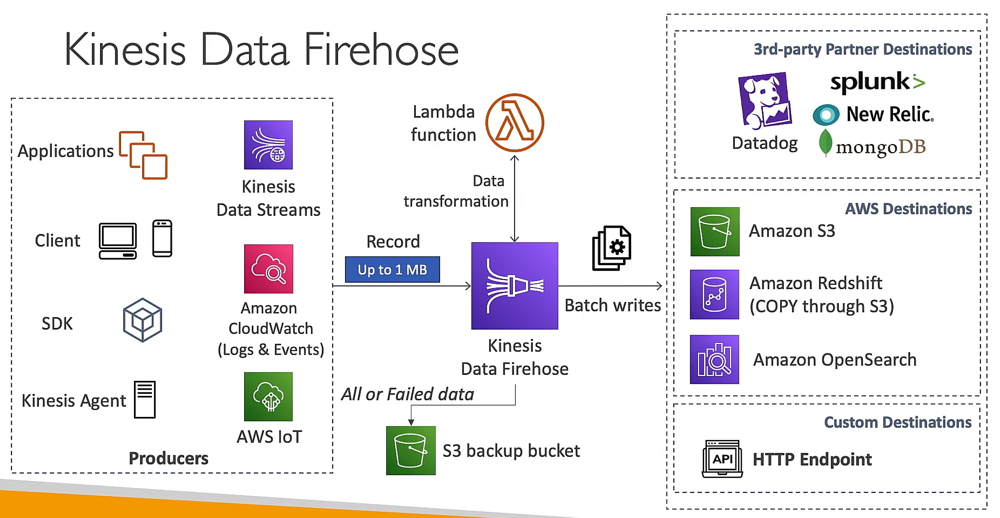
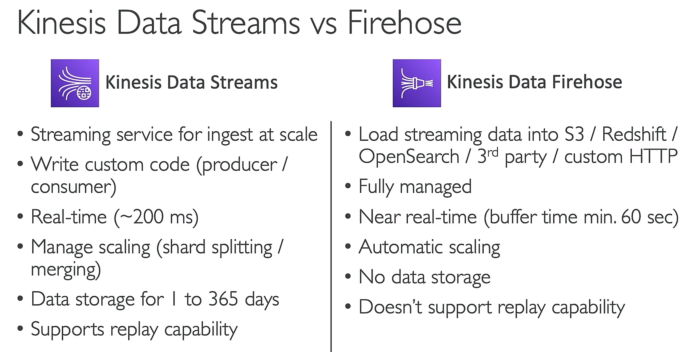

## AWS SQS
- Amazon Simple Queue Service (SQS) is a fully managed message queuing service that makes it easy to decouple and scale microservices, distributed systems, and serverless applications.
- unlimited throughput, no limit on the number of messages
- message retention period: default 4 days, maximum 14 days.
- limit on message size 256kb
- can have duplicate messages, out of order messages => need to handle in application or use FIFO queue
- SQS Access Policy

### Message Visibility Timeout
- the amount of time that the message is invisible in the queue after a reader picks up the message.
- can increase timeout by calling ChangeMessageVisibility API

### long polling
- if no message in queue, the request will wait for a message to arrive for a certain amount of time.

## AWS SNS
- publish/subscribe messaging service
- SNS FIFO (only SQS can subscribe)
- message filtering

### Fanout
SNS + multiple SQS

## Amazon Kinesis
### Kinesis Data Streams
- real-time data streaming service
- data retention: default 24 hours, maximum 365 days
- once data inserted, cannot be deleted
- provisioned mode, on-demand mode
- VPC endpoint available

### Kinensis Data Firehose
- data transformation, compression, encryption
- batch data delivery
- serverless

### Kinesis Data Analytics
### Kinesis Video Streams