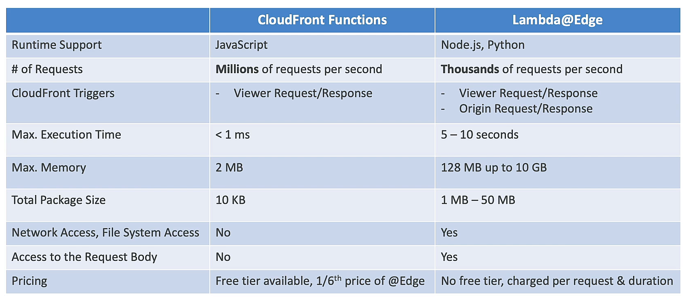
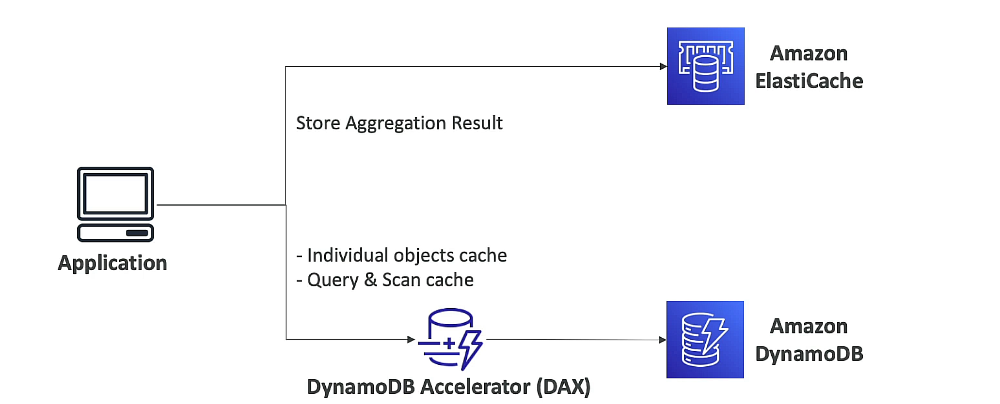

## AWS Lambda
- AWS Lambda is a serverless compute service that lets you run code without provisioning or managing servers.
- Lambda runs your code only when needed and scales automatically, from a few requests per day to thousands per second.
- You pay only for the compute time you consume - there is no charge when your code is not running.
### limitation (per region)
- memory: 128MB - 10GB (more memory, need more vCPU)
- max execution time: 15 minutes
- environment variables: 4KB
- /tmp directory storage: 512MB to 10GB
- concurrent executions: 1000
- deployment package: 50MB (zipped)
- deployment package: 250MB (unzipped)

### snapstart

### lambda@edge / cloudfront functions

## DynamoDB
- Amazon DynamoDB is a fully managed, serverless, key-value and document database that delivers single-digit millisecond performance at any scale.
- standard table: high availability, durability, and performance
- IA table: infrequently accessed data
- max item size: 400KB
- provisioned mode, on-demand mode

### DynamoDB Accelerator (DAX)
- Amazon DynamoDB Accelerator (DAX) is a fully managed, highly available, in-memory cache for DynamoDB that delivers up to a 10x performance improvement - from milliseconds to microseconds - even at millions of requests per second.
- microseconds latency
- no need to modify application

### DynamoDB Streams
- DynamoDB Streams is an optional feature that captures data modification events in DynamoDB tables.
- can trigger lambda function, SQS, Kinesis
- 24 hours retention period
- limit: 5 active streams per table

### Global Tables
- Amazon DynamoDB global tables provide a fully managed solution for deploying a multi-region, multi-master database, without having to build and maintain your own replication solution.
- automatic replication
- must enable DynamoDB Streams

### backup and restore

- Point-in-Time Recovery
	- Point-in-time recovery helps protect your DynamoDB tables from accidental write or delete operations.
	- restore to any point in time within 35 days
	- the recovery process creates a new table
- on-demand backup
	- restore to any point
	- the recovery process creates a new table

## API Gateway
- Amazon API Gateway is a fully managed service that makes it easy for developers to create, publish, maintain, monitor, and secure APIs at any scale.
- Edge-optimized API: global, use CloudFront
- Regional API: regional, use API Gateway
- Private API: VPC endpoint

## Step Functions
- AWS Step Functions is a serverless function orchestrator that makes it easy to sequence AWS Lambda functions and multiple AWS services into business-critical applications.

## Amazon Cognito
- Amazon Cognito lets you add user sign-up, sign-in, and access control to your web and mobile apps quickly and easily.
- User Pools: user directory
- Identity Pools: federated identity, temporary access AWS resources
