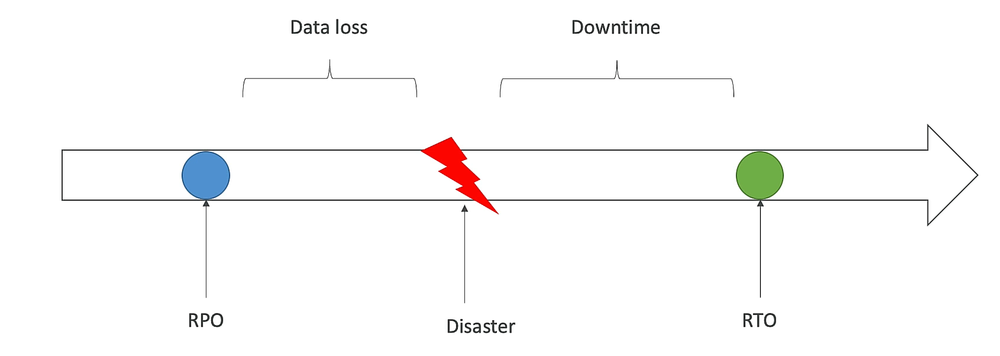

# Disaster Recovery(DR)
- RPO: Recovery Point Objective
	- the maximum acceptable amount of data loss measured in time
- RTO: Recovery Time Objective
	- the maximum acceptable amount of time to recover the system

## DR Strategies
- Backup and Restore: Simple but RPO and RTO are high
- Pilot Light: Minimal version of the environment is always running
- Warm Standby: A scaled-down version of a fully functional environment is always running
- Hot-site / Multi-Site Approach: Fully functional environment is always running

# Database Migration Service(DMS)
- migrate data from one database to another
- source is available during migration
- Homogeneous Migration: same database engine
- Heterogeneous Migration: different database engine. must use Schema Conversion Tool(SCT)
- Continuous Data Replication using CDC
