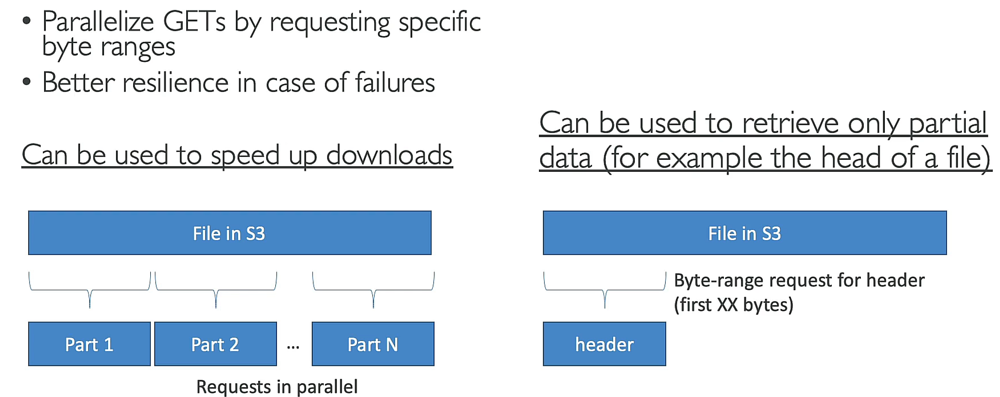
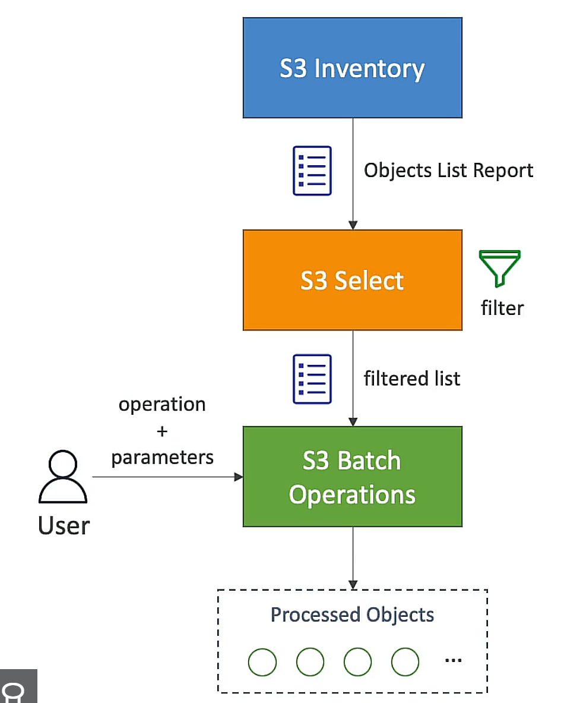

## AWS S3
- `Simple Storage Service`
- `object storage` service
- `unlimited storage`
- defined at `region` level
- max object size: `5TB` (larger objects than 5GB can be stored using `multipart upload`)
- key: full path
- value: body
- version ID: enabled at the bucket level
- metadata
- tags

### security
- user-based
	- IAM policies
- resource-based
	- bucket policies: allows cross account
	- bucket ACL(Access Control List)
	- object ACL
- block public access

### replication
- `CRR`: Cross-Region Replication
- `SRR`: Same-Region Replication
- `versioning` must be enabled on both source and destination buckets
- `replication` is `asynchronous`
- `replication` is `cross-account`

#### delete marker replication
- `delete marker` is replicated
- optional setting

#### S3 batch replication
- can replicate existing objects and failed replication

### storage classes
- `S3 Standard`: `99.99%` availability, general purpose
#### infrequent access
: for data that is less frequently accessed but requires rapid access when needed
- `S3 Standard-IA`: `99.9%` availability
- `S3 One Zone-IA`: `99.5%` availability
#### Glacier
: lower cost, for archive / backup
- `S3 Glacier instant retrieval`: milliseconds retrieval, 90 days minimum storage
- `S3 Glacier flexible retireval`: minutes to hours retrieval, 90 days minimum storage
- `S3 Glacier Deep Archive`: 12 hours to 48 hours retrieval, 180 days minimum storage

- `S3 Intelligent-Tiering`: auto pricing, auto move between IA and Standard

### lifecycle rule
: automate moving objects between storage classes
- transition action
- expriation action

### event notification
- `S3 event notification`: `SNS`, `SQS`, `Lambda`

### S3 baseline performance
- `3,500 PUT/COPY/POST/DELETE` and `5,500 GET/HEAD` requests per second `per prefix` in a bucket

### S3 Transfer Acceleration
- `CloudFront` edge locations
- `multipart upload` is compatible

### S3 byte-range fetches

### S3 select and Glacier select
- `S3 select`: SQL query on S3 objects
- `Glacier select`: SQL query on Glacier objects

### S3 Batch Operations
- `S3 Batch Operations`: `S3` operations on `large number` of objects
use cases: encrypt unencrypted objects, copy objects, ...

### storage lens
- multi-account, multi-region analyze dashboard

### S3 encryption
- SSE
	- `SSE-S3`: `S3` managed keys, enabled by default, must set request header `x-amz-server-side-encryption: AES256`
	- `SSE-KMS`: `KMS` managed, must set request header `x-amz-server-side-encryption: aws:kms`, request limits
	- `SSE-C`: `customer` managed, must set request header `x-amz-server-side-encryption-customer-algorithm: AES256`, must provide encryption key
- CSE
	- `client-side` encryption

### MFA
- permanently delete objects
- suspend versioning on bucket
- to enable, must enable versioning on bucket and only the bucket owner(root account) can enable MFA

### S3 glacier vault lock
- `compliance` and `WORM` (Write Once Read Many) model
- bucket level lock

### S3 Object Lock
- `compliance` and `WORM` (Write Once Read Many) model
- block object deletion for a specified retention period
- must set versioning
- `compliance` and `governance` mode
- legal hold: protect object from deletion indefinitely
