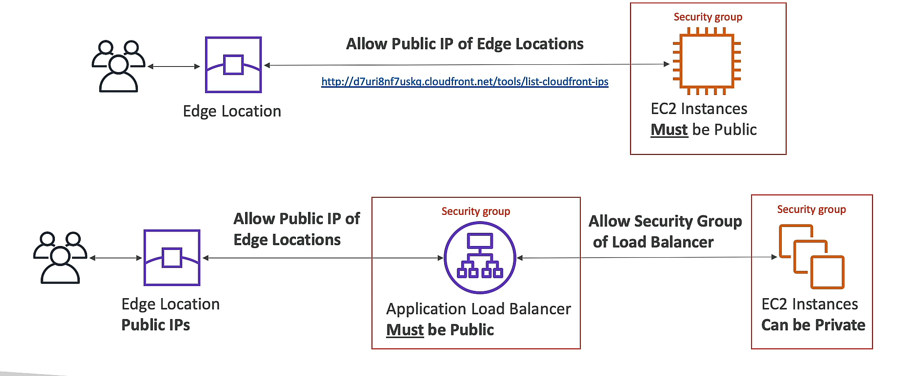

## CloudFront
- `CDN`: Content Delivery Network
- `edge location`: cache content
- TTL: Time To Live. Cache Invalidation
- `origin`: source of the file the CDN will distribute
	- `S3 bucket`: also used as ingress
	- `EC2 instance`
	- `ELB`
	- `any HTTP server`
- `distribution`: the name given to the CDN which consists of a collection of edge locations

### price class
- `price class`: the number of edge locations used
	- `all`: all edge locations
	- `200`: all edge locations except the most expensive
	- `100`: only the least expensive edge locations

### AWS Global Accelerator
- `AWS Global Accelerator`: improve the availability and performance of your applications with local or global users
- `Anycast IP`: route user traffic to the nearest edge location
- `static IP`: anycast IP