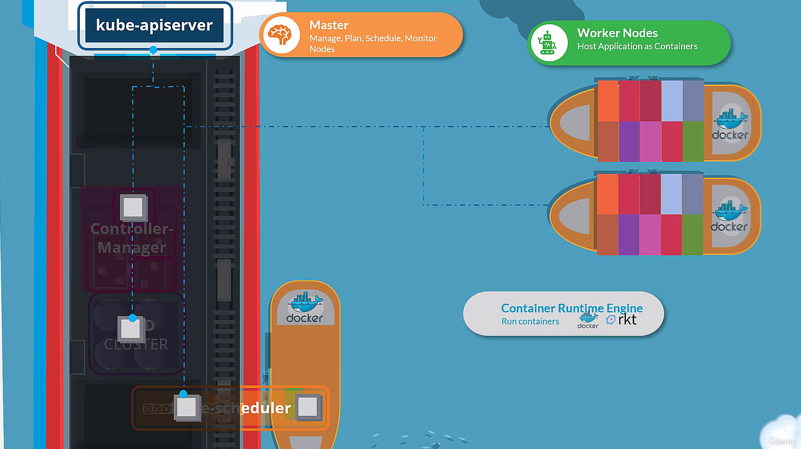
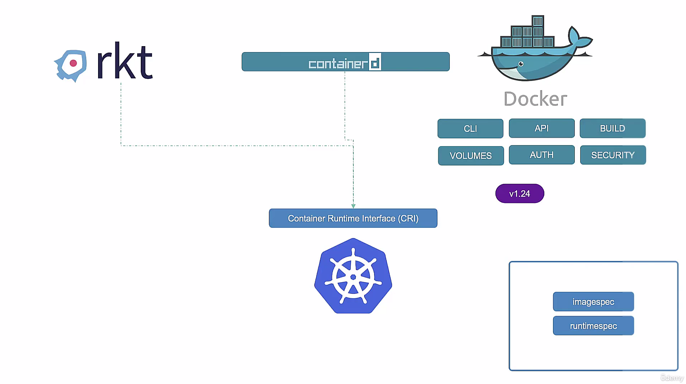
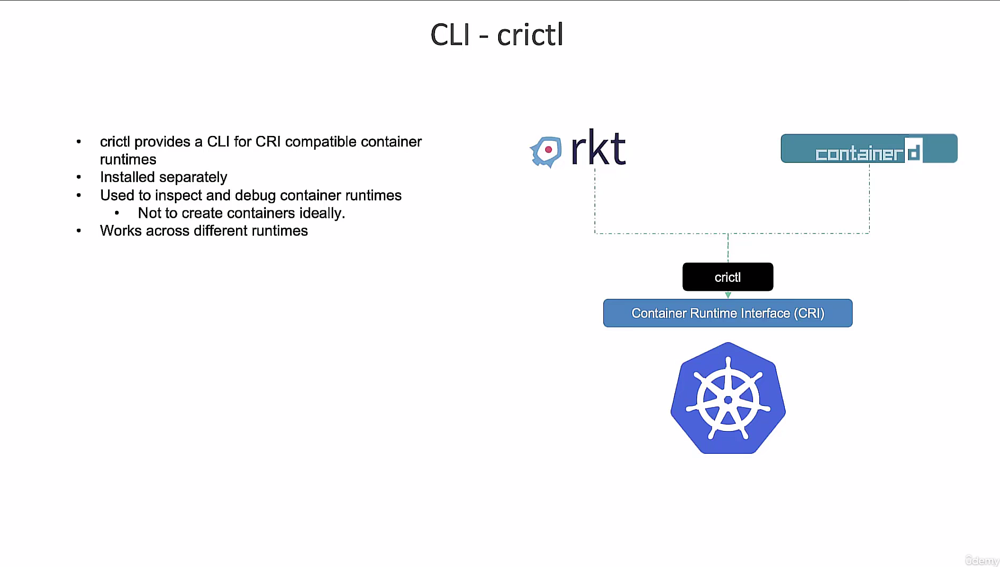
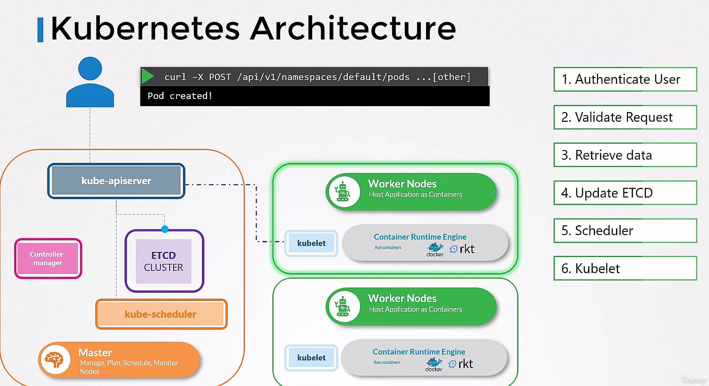

# k8s cluster architecture

- master nodes: manage the worker nodes and the pods in the cluster
    - etcd: key-value store for all cluster data
    - kube-scheduler: schedules pods to worker nodes
    - kube-controller-manager: runs controller processes
    - replication controller: ensures that the correct number of pods are running
    - node controller: monitors the nodes
- worker nodes: host the pods that are the components of the application
    - kubelet: communicates with the master node
    - kube-proxy: forwards requests to the correct pod

## docker vs containerd

- initially, k8s was built on top of docker
- gradually, k8s started `supporting other container runtimes` like containerd, cri-o, etc. and `built a container runtime interface (CRI)` to support multiple container runtimes
- docker was not designed to be a container runtime, it was designed to be a container engine so it has a lot of features that are not needed by k8s and `removed.`

## etcd
- key-value store for all cluster data
- stores nodes, pods, configs, secrets, accounts, roles, bindings, etc.

## kube-api-server

## kube-controller-manager
## kube-scheduler
## kubelet
- must be installed on every node in the cluster `manually`
## kube-proxy
- kubeadm automatically installs kube-proxy on every node using daemonset
- when a service is created, kube-proxy creates a set of iptables rules to forward traffic to the correct pod