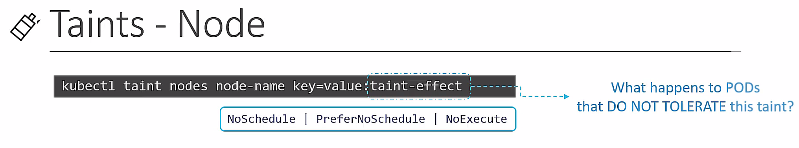
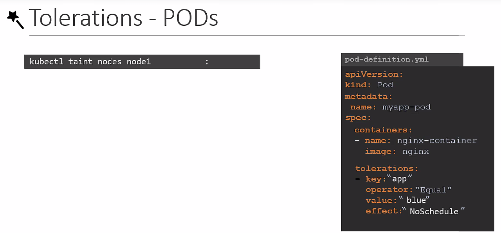
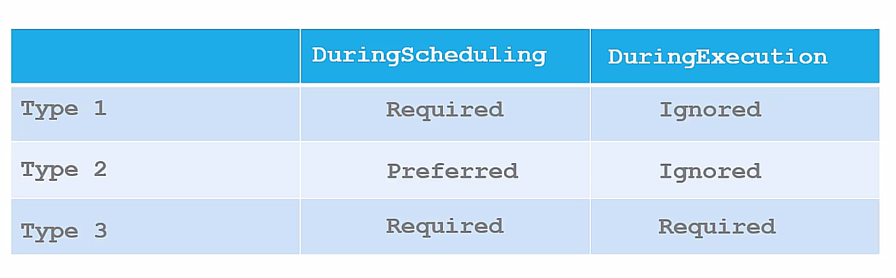
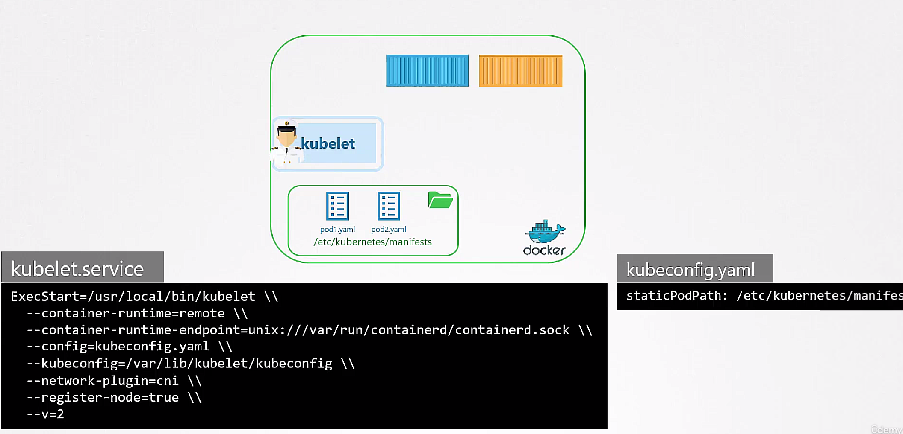
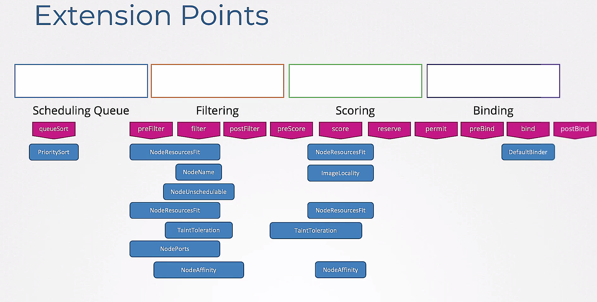

## manual scheduling
if scheduler is not exist, user can mannually schedule pods to nodes
- in pod spec, set `nodeName` field to the name of the node
- if the node is not exist, the pod will be in `Pending` state
- bind request

## taints and tolerations
- taints: a taint is a key-value pair that is applied to a node
- tolerations: a toleration is a key-value pair that is applied to a pod

- not garantee that the pod will be scheduled to the node

## node affinity

## resource limits, requests
- resource limits: the maximum amount of resources that a container can use
- resource requests: the amount of resources that a container is guaranteed to have
- resource quotas: the maximum amount of resources that a namespace can use
- limit range: the minimum and maximum amount of resources that a container can use when it is created

## static pod
- static pod is a pod that is created by the kubelet on a node
- if kube-api is available, the kubelet will create the mirror pod in the api server. that is read-only

or in /etc/kubernetes/manifests

## multiple shedulers

## configuring sheduler profile
: single sheduler, multi profile

