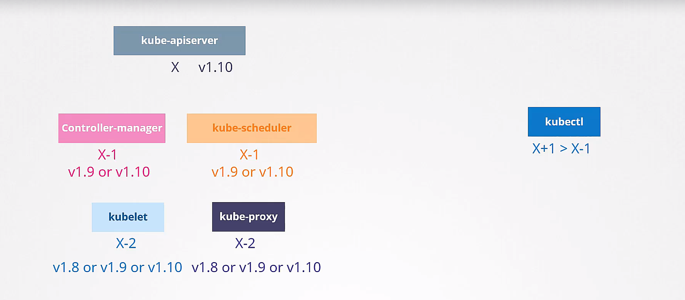
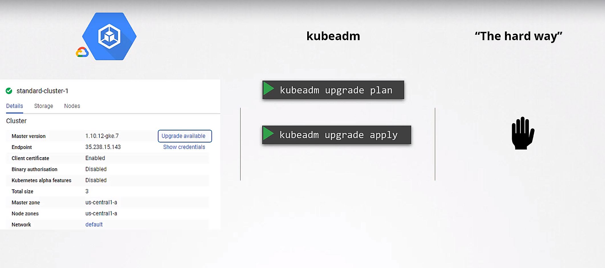
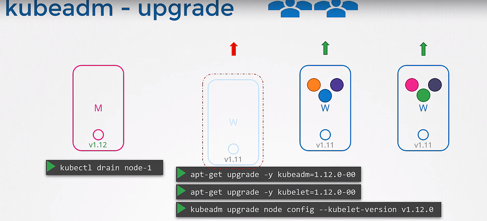

## fail tolerance
- k8s wait for 5 minutes to mark a node as 'dead' in default
- if a node is marked as 'dead', the pods on the node will be rescheduled to other nodes
- drain: remove all the pods from a node and reschedule them to other nodes
- cordon: mark a node as 'unschedulable' so that no new pods will be scheduled to the node
- uncordon: mark a node as 'schedulable' so that new pods can be scheduled to the node but the original pods will not be rescheduled

## cluster upgrade process

- k8s supports up to recent 3 minor versions

### kubeadm upgrade
1. upgrade kubeadm
2. command: `kubeadm upgrade apply`
3. upgrade kubelet and kubectl
