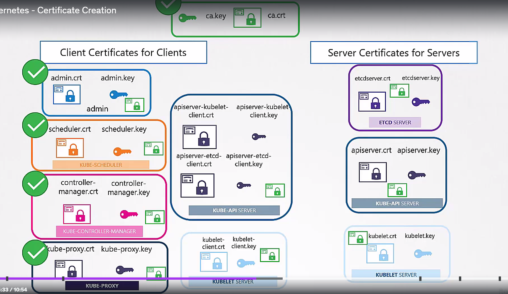
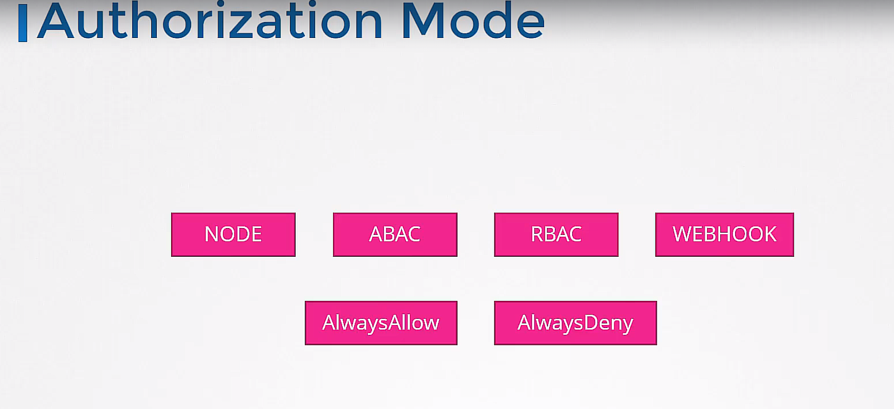
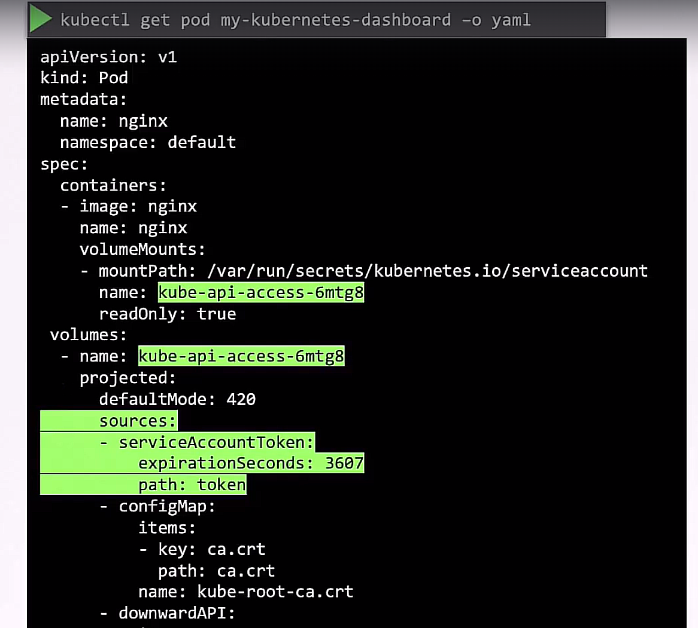

## Authentication
- k8s does not support user authentication by default (except service accounts)

### TLS in k8s
- k8s uses TLS to secure communication between components

- user can grouped by certificate's `Common Name` or `Organization` field
- node's group name is `system:nodes`

### kube config file
- `~/.kube/config` file is used to store k8s cluster information
- `kubectl` uses this file to connect to the cluster
- clusters, users, context

## Authorization
### API groups
- k8s API is divided into groups
- `core` group is the default group
- group has its own set of resources and verbs

### RBAC
1. create Role object (namespace scoped resources)
2. create RoleBinding object

or 

1. create ClusterRole object (cluster scoped resources)
2. create ClusterRoleBinding object

### service account
1. create ServiceAccount object
2. then it create token
3. then create secret object with the token
4. then secret object is linked to the service account
5. and the token is automatically mounted to the pod

=> but this is not secure, and scalable => TokenRequest API is used

## image security
if you use private image registry, you need to create secret object
1. create `docker-registry` type secret
2. add `imagePullSecrets` field in the pod spec