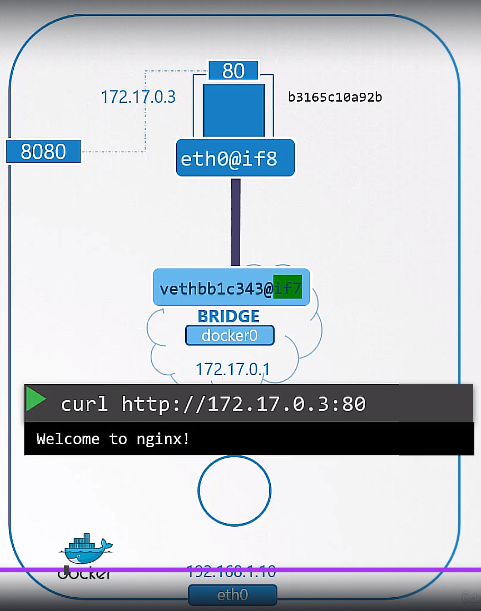

## core DNS
- k8s uses `coreDNS` to provide DNS service

## network plugin

### bridge type network

- all container runtime solutions use same bridge script
- and you can use third party plugins like `flannel`, `calico`, `weave`, etc.